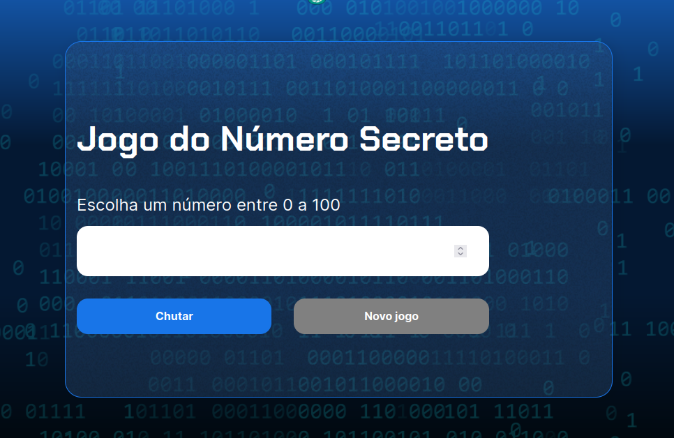

<h1 align="center">Jogo do Número Secreto</h1>

	

<h2 align="center">Tecnologias</h2>

	
	

<h2 align="center">Sobre</h2>

Este é um jogo simples de descubrir o número secreto por tentativas, o sistema irá lhe dar dica se o número tentado é maior ou menor que o número secreto

<h2 align="center">Como Jogar?</h2>

Para isso basta clicar na imagem abaixo que você será direcionado para o jogo numa nova aba

<h2 align="center">Tecnologias</h2>

Foi usado nesse projeto a tecnologia <a href="https://responsivevoice.org/" target="_noblank">ResponsiveVoice</a> usada para converter texto em voz

<h2 align="center">Autores</h2>

	</a>

	
Sandra Martini

	<a href="mailto://poluxsandra@outlook.com">poluxsandra@outlook.com</a>

